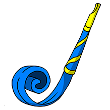

### <!-- greeting  -->

  

  
  
  

 
  
<b>Profile Views</b>

  

<!-- views counter -->

---

<!-- hero -->

### About Me :

I am a Full Stack Developer from Ukraine 

- :open_book: I’m a student-switcher and interested in Programming.
- :open_book: I’m currently learning HTML5, CSS3, SCSS, SASS, JavaScript, React, Redux, NodeJS, Vue.js, TypeScript.
- :open_book: Love studing and sharing knowledge.
- :email: How to reach me: 

---

### :hammer_and_wrench: Languages and Tools :

  <!-- &nbsp;&nbsp; -->
  
&nbsp;&nbsp;
&nbsp;&nbsp;
&nbsp;&nbsp;
&nbsp;&nbsp;
&nbsp;&nbsp;
&nbsp;&nbsp;
&nbsp;&nbsp;
&nbsp;&nbsp;
-
&nbsp;&nbsp;
&nbsp;&nbsp;
&nbsp;&nbsp;
&nbsp;&nbsp;
- 
&nbsp;&nbsp;
&nbsp;&nbsp;
&nbsp;&nbsp;
&nbsp;&nbsp;
&nbsp;&nbsp;
&nbsp;&nbsp;
-
&nbsp;&nbsp;
&nbsp;&nbsp;
&nbsp;&nbsp;
&nbsp;&nbsp;
&nbsp;&nbsp;
&nbsp;&nbsp;
&nbsp;&nbsp;
&nbsp;&nbsp;
&nbsp;&nbsp;
&nbsp;&nbsp;
&nbsp;&nbsp;
&nbsp;&nbsp;
- 
&nbsp;&nbsp;

---

### :fire: My Stats :

 
  

 

